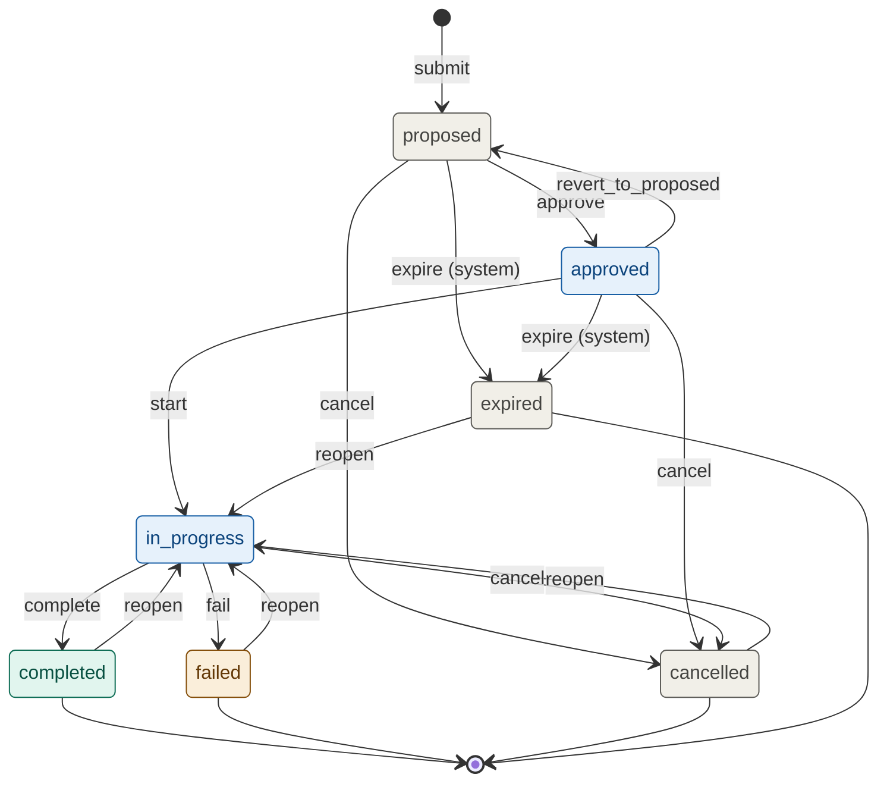
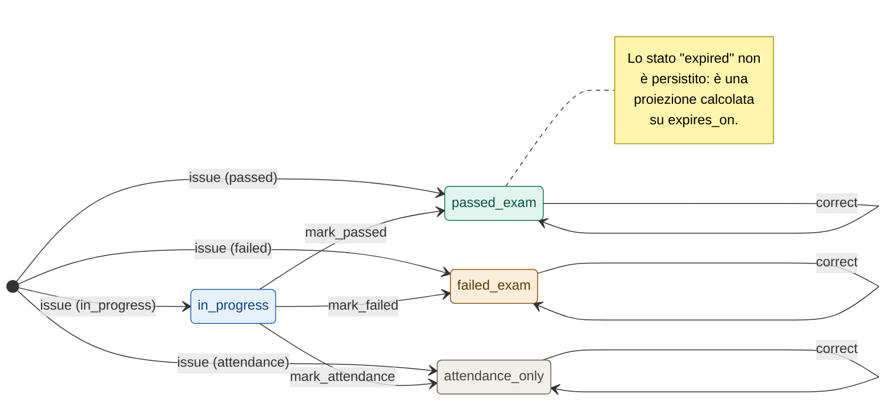
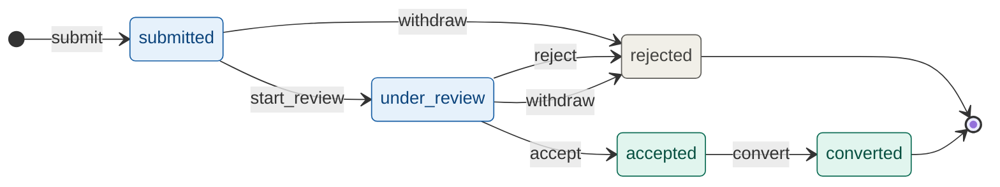

# State Machines — CDLAN Training Management Tool

Documento di riferimento per le transizioni di stato delle tre entità dinamiche del dominio:

1. [`enrollment`](#1-enrollment) — iscrizione di un dipendente a un corso in un piano
2. [`certification_award`](#2-certification_award) — conseguimento di una certificazione
3. [`training_request`](#3-training_request) — richiesta/suggerimento di formazione

Le state machine descritte qui sono la fonte autoritativa. La loro implementazione è duplicata in due punti:

- `state_machines.ts` — specifica eseguibile applicativa (traduzione meccanica in Go nel backend)
- `enrollment_state_trigger.sql` — guardia di ultimo livello a livello DB (solo per `enrollment`)

Quando una transizione viene aggiunta o modificata qui, **entrambe** le implementazioni vanno aggiornate. Un test di integrazione dedicato verifica la sincronizzazione.

---

## Principi di design

**Stati terminali.** Una volta entrata in uno stato terminale, l'entità è "fredda": l'integrità dell'audit prevale sulla flessibilità. La riapertura richiede una transizione esplicita (`reopen`), distinta dal flusso normale, e una motivazione testuale obbligatoria.

**Attori applicativi.** Quattro ruoli:

- `employee` — il dipendente stesso (può agire solo su record di cui è soggetto/creatore)
- `manager` — manager di team (può agire sui propri riporti, modellato anche se al momento non c'è il ruolo formalmente definito)
- `people_admin` — People (accesso pieno)
- `system` — job automatici (transizioni scatenate da eventi temporali o di pianificazione)

**Guard clauses.** Le precondizioni di stato esterno (es. "il piano non è chiuso") sono dichiarate in tabella; le validazioni di shape vivono nei `CHECK` del DDL.

**Side-effect deterministici.** Quando una transizione genera modifiche collaterali (snapshot dei dati di catalogo, creazione di altre entità), sono dichiarate esplicitamente. Niente "magia" implicita nei trigger.

**Bypass per migrazione.** Per l'import storico è disponibile il bypass `SET LOCAL training.allow_status_override = 'true'` — usato solo dai job di migrazione, dentro la stessa transazione.

---

## 1. `enrollment`

Sette stati, undici transizioni. È la macchina più complessa perché modella sia il ciclo di pianificazione (proposta → approvazione) sia il ciclo operativo (in corso → chiusura) sia la possibilità di correzioni/riaperture.

### Diagramma

### Stati

| Stato | Descrizione | Terminale |
|---|---|---|
| `proposed` | Inserita nel piano, non ancora approvata da People | no |
| `approved` | Approvata, in attesa di partire | no |
| `in_progress` | Il dipendente sta seguendo il corso | no |
| `completed` | Conclusa con successo (frequenza/esame come da catalogo) | sì |
| `failed` | Conclusa ma esame non superato (es. *CCNP BOCCIATO ESAME*) | sì |
| `cancelled` | Annullata prima del termine | sì |
| `expired` | Mai partita entro la chiusura del piano | sì |

### Transizioni

| Transizione | Da → A | Attore | Guard | Side effect |
|---|---|---|---|---|
| `submit` | `[*]` → `proposed` | `employee`, `manager`, `people_admin` | piano del corso in stato `draft` o `open` | crea record |
| `approve` | `proposed` → `approved` | `people_admin` | piano non `closed`/`frozen` | — |
| `revert_to_proposed` | `approved` → `proposed` | `people_admin` | piano non `closed`; `reason` obbligatoria | — |
| `start` | `approved` → `in_progress` | `people_admin`, `employee` | `actual_start` non nel futuro | imposta `actual_start = today` se NULL |
| `complete` | `in_progress` → `completed` | `people_admin`, `employee` | `actual_end >= actual_start` | popola `course_title_snapshot`, `vendor_name_snapshot`; se corso ha `leads_to_cert_id` → propone creazione `certification_award` |
| `fail` | `in_progress` → `failed` | `people_admin` | corso ha `leads_to_cert_id` valorizzato | popola snapshot; **non** crea award |
| `cancel` | `proposed` / `approved` / `in_progress` → `cancelled` | `people_admin`, `manager` | `reason` obbligatoria | popola snapshot |
| `expire` | `proposed` / `approved` → `expired` | `system` | piano transitato in `closed`; nessun `actual_start` | popola snapshot |
| `reopen` | qualunque terminale → `in_progress` | `people_admin` | `reason` obbligatoria | crea audit entry dedicata (`action = 'enrollment.reopened'`) con before_state completo |

### Note di design

**`revert_to_proposed`** esiste perché People può approvare per errore, soprattutto durante le approvazioni in massa di fine pianificazione. È la differenza fra *stato di processo* (proposed/approved, reversibili senza dramma) e *stato di realtà* (in_progress in poi, reversibili solo via `reopen` esplicita).

**`complete` propone ma non crea** automaticamente la `certification_award`. Scelta intenzionale: se il corso è solo "frequenza" non serve award, se è "frequenza + esame" l'esito può essere passed/failed e va inserito a mano da People (oppure caricato dall'utente con il PDF). Una creazione automatica forzata sporcherebbe i dati.

**`expire` è l'unica transizione `system`**: un job notturno la esegue quando il piano transita a `closed`. Senza, restano `enrollment` in stato `approved` per anni nei vecchi piani.

**`reopen` è la transizione pericolosa**. Riapre uno stato terminale. Per non perdere la battaglia di compliance: (1) UI con conferma esplicita stile *"stai per riaprire un dato chiuso, confermi?"*, (2) tag dedicato `audit_log.action = 'enrollment.reopened'` con `before_state` JSON completo, così la query *"dimmi tutte le riaperture dell'ultimo anno"* è banale.

---

## 2. `certification_award`

Più semplice di `enrollment`. Quattro outcome operativi più un quinto stato derivato (`expired`) che non è scritto in tabella ma calcolato da `expires_on < today`.

### Diagramma

### Stati (outcome)

| Outcome | Descrizione |
|---|---|
| `in_progress` | Certificazione in corso (es. *Certified Kubernetes Administrator - IN CORSO*) |
| `passed_exam` | Esame superato; certificazione valida (fino a `expires_on`) |
| `failed_exam` | Esame sostenuto e non superato |
| `attendance_only` | Solo attestato di frequenza, senza esame |

### Transizioni

| Transizione | Da → A | Attore | Guard | Side effect |
|---|---|---|---|---|
| `issue` | `[*]` → outcome scelto | `people_admin`, `employee` | — | se `passed_exam` e cert ha `typical_validity`, calcola `expires_on` automaticamente |
| `mark_passed` | `in_progress` → `passed_exam` | `people_admin`, `employee` | doc verificato richiesto se attore = `employee` | popola `awarded_on` (se NULL = today); calcola `expires_on` |
| `mark_failed` | `in_progress` → `failed_exam` | `people_admin`, `employee` | — | popola `awarded_on` |
| `mark_attendance` | `in_progress` → `attendance_only` | `people_admin`, `employee` | — | popola `awarded_on` |
| `correct` | qualunque → stesso outcome (con valori modificati) | `people_admin` | `reason` obbligatoria | audit pesante: `before_state` e `after_state` JSON completi |

### Note di design

**Lo "scaduto" non è uno stato persistito, è una proiezione.** Una certificazione scaduta resta `outcome = 'passed_exam'` con `expires_on < today`. È fondamentale per due ragioni:

1. **Storico immutabile**: se una cert era valida nel 2024, lo era; non vuoi che cambi tipo a posteriori.
2. **Rinnovi**: un dipendente può avere più award successive della stessa certificazione (es. 2018, 2021, 2024, 2027). Tutte `passed_exam`, alcune con `expires_on` superato, una valida. La query *"ha la cert valida oggi?"* è banale: filtra per `outcome = 'passed_exam' AND (expires_on IS NULL OR expires_on > today)`.

**Il rinnovo non è una transizione**, è una nuova award. La vecchia resta intatta come storico — uno dei punti dove lo schema diverge esplicitamente dall'Excel attuale, che cancella e sovrascrive.

**`correct` riresta nello stesso stato** ma con valori modificati (correzione di date, outcome, allegati). È il punto in cui si manomette lo storico e va auditato pesantemente. La UI di People deve usarlo solo per correzioni reali, non per rinnovi.

---

## 3. `training_request`

Coda di triage per le richieste/suggerimenti dei dipendenti. Cinque stati, sei transizioni.

### Diagramma

### Stati

| Stato | Descrizione | Terminale |
|---|---|---|
| `submitted` | Richiesta nuova, in coda | no |
| `under_review` | Presa in carico da People | no |
| `accepted` | Accettata concettualmente, in attesa di un piano apribile | no |
| `rejected` | Respinta o ritirata | sì |
| `converted` | Convertita in `enrollment` su un piano | sì |

### Transizioni

| Transizione | Da → A | Attore | Guard | Side effect |
|---|---|---|---|---|
| `submit` | `[*]` → `submitted` | `employee` | almeno uno tra `course_id` e `free_text_title` valorizzato | crea record |
| `start_review` | `submitted` → `under_review` | `people_admin` | — | imposta `reviewed_by`, `reviewed_at` |
| `accept` | `under_review` → `accepted` | `people_admin` | — | — |
| `reject` | `submitted` / `under_review` → `rejected` | `people_admin` | `reason` (review_notes) obbligatoria | — |
| `convert` | `accepted` → `converted` | `people_admin` | esiste un `training_plan(year = desired_year)` in stato `draft` o `open` | crea `enrollment` collegata; popola `converted_to_enrollment_id` |
| `withdraw` | `submitted` / `under_review` → `rejected` | `employee` (solo creatore) | — | marca review_notes con motivo automatico |

### Note di design

**`accepted` è uno stato intermedio non terminale** perché People può accettare concettualmente la richiesta ma non avere ancora un piano dell'anno target aperto. Esempio: dipendente chiede a febbraio 2026 un corso per il 2027; People dice *"OK lo facciamo"*, ma il `training_plan(year=2027)` non esiste ancora. Quando lo apriremo, la richiesta `accepted` farà da memoria per generare la `enrollment`.

**`converted` è terminale** ma non blocca nulla: il link `converted_to_enrollment_id` mantiene tracciabile l'origine della richiesta. È il pattern che permette report tipo *"quante delle iscrizioni 2027 sono nate da richieste dei dipendenti?"*.

**`withdraw` riporta a `rejected`** invece di introdurre uno stato `withdrawn` dedicato per minimizzare la cardinalità degli stati terminali. La differenza tra "ritirata dall'utente" e "respinta da People" sta nell'attore registrato in audit log, non nello stato.

---

## Sincronizzazione fra applicazione e database

Le state machine vivono in due implementazioni che devono restare sincronizzate:

1. **Applicativa** (`state_machines.ts` → Go nel backend): valida tutte le precondizioni con il contesto completo (attore, reason, stato piano, ownership). È la prima linea di difesa.
2. **Database** (`enrollment_state_trigger.sql`): valida solo la matrice meccanica delle transizioni, indipendentemente dal contesto applicativo. È la rete di sicurezza contro UPDATE diretti via psql/migration/script.

Le precondizioni "esterne" (chi è l'attore, esiste la reason, lo stato del piano) non sono replicate nel trigger DB perché:

- non c'è contesto sufficiente al livello DB senza pesanti tabelle di sessione,
- duplicarle aumenta la superficie di drift fra le due implementazioni,
- il trigger blocca comunque transizioni meccanicamente assurde, che è il bug class più probabile.

**Test di integrazione**: per ogni coppia `(stato_origine, transizione)` definita qui, un test verifica che applicazione e trigger DB concordino sul risultato (entrambi accettano o entrambi rifiutano). Eseguito in CI a ogni modifica di una delle due implementazioni.

---

## Manutenzione del documento

Quando si modifica una state machine:

1. Aggiornare il diagramma Mermaid e la tabella delle transizioni in questo file
2. Aggiornare `state_machines.ts` (matrice + guard)
3. Aggiornare il trigger DB se la modifica riguarda `enrollment`
4. Eseguire il test di integrazione e verificare il pass
5. Aggiornare la versione del documento sotto

| Versione | Data | Modifiche |
|---|---|---|
| 1.0 | 2026-05-19 | Versione iniziale: enrollment, certification_award, training_request |
