```mermaid
erDiagram
    maintenance."maintenance" {
        bigint maintenance_id PK
        text code UK
        text title_it
        text title_en
        text description_it
        text description_en
        bigint maintenance_kind_id FK
        bigint technical_domain_id FK
        bigint customer_scope_id FK
        text status
        bigint site_id FK
        text reason_it
        text reason_en
        text residual_service_it
        text residual_service_en
        bigint owner_admin_id
        bigint created_by_admin_id
        bigint updated_by_admin_id
        timestamptz created_at
        timestamptz updated_at
        jsonb metadata
    }

    maintenance."site" {
        bigint site_id PK
        text code
        text name
        text city
        char country_code
        boolean is_active
        text scope
        bigint owner_maintenance_id FK "Self-ref: maintenance"
        jsonb metadata
    }

    maintenance."technical_domain" {
        bigint technical_domain_id PK
        text code UK
        text name_it
        text name_en
        text description
        text[] synonyms
        integer sort_order
        boolean is_active
        jsonb metadata
    }

    maintenance."maintenance_kind" {
        bigint maintenance_kind_id PK
        text code UK
        text name_it
        text name_en
        text description
        text[] synonyms
        integer sort_order
        boolean is_active
        jsonb metadata
    }

    maintenance."customer_scope" {
        bigint customer_scope_id PK
        text code UK
        text name_it
        text name_en
        text description
        text[] synonyms
        integer sort_order
        boolean is_active
        jsonb metadata
    }

    maintenance."reason_class" {
        bigint reason_class_id PK
        text code UK
        text name_it
        text name_en
        text description
        text[] synonyms
        integer sort_order
        boolean is_active
        jsonb metadata
    }

    maintenance."impact_effect" {
        bigint impact_effect_id PK
        text code UK
        text name_it
        text name_en
        text description
        text[] synonyms
        integer sort_order
        boolean is_active
        jsonb metadata
    }

    maintenance."quality_flag" {
        bigint quality_flag_id PK
        text code UK
        text name_it
        text name_en
        text description
        text[] synonyms
        integer sort_order
        boolean is_active
        jsonb metadata
    }

    maintenance."target_type" {
        bigint target_type_id PK
        text code UK
        text name_it
        text name_en
        text description
        text[] synonyms
        integer sort_order
        boolean is_active
        jsonb metadata
    }

    maintenance."notice_channel" {
        bigint notice_channel_id PK
        text code UK
        text name_it
        text name_en
        text description
        text[] synonyms
        integer sort_order
        boolean is_active
        jsonb metadata
    }

    maintenance."service_taxonomy" {
        bigint service_taxonomy_id PK
        text code UK
        bigint technical_domain_id FK
        bigint target_type_id FK
        text audience
        text name_it
        text name_en
        text description
        text[] synonyms
        integer sort_order
        boolean is_active
        jsonb metadata
    }

    maintenance."service_dependency" {
        bigint service_dependency_id PK
        bigint upstream_service_id FK
        bigint downstream_service_id FK
        text dependency_type
        boolean is_redundant
        text default_severity
        text source
        boolean is_active
        jsonb metadata
        timestamptz created_at
        timestamptz updated_at
    }

    maintenance."llm_model" {
        text scope PK
        text model
    }

    maintenance."maintenance_service_taxonomy" {
        bigint maintenance_service_taxonomy_id PK
        bigint maintenance_id FK
        bigint service_taxonomy_id FK
        text source
        numeric confidence
        boolean is_primary
        text role
        text expected_severity
        text expected_audience
        jsonb metadata
    }

    maintenance."maintenance_reason_class" {
        bigint maintenance_reason_class_id PK
        bigint maintenance_id FK
        bigint reason_class_id FK
        text source
        numeric confidence
        boolean is_primary
        jsonb metadata
    }

    maintenance."maintenance_impact_effect" {
        bigint maintenance_impact_effect_id PK
        bigint maintenance_id FK
        bigint impact_effect_id FK
        text source
        numeric confidence
        boolean is_primary
        jsonb metadata
    }

    maintenance."maintenance_quality_flag" {
        bigint maintenance_quality_flag_id PK
        bigint maintenance_id FK
        bigint quality_flag_id FK
        text source
        numeric confidence
        jsonb metadata
    }

    maintenance."maintenance_window" {
        bigint maintenance_window_id PK
        bigint maintenance_id FK
        integer seq_no
        text window_status
        timestamptz scheduled_start_at
        timestamptz scheduled_end_at
        integer expected_downtime_minutes
        timestamptz actual_start_at
        timestamptz actual_end_at
        integer actual_downtime_minutes
        text cancellation_reason_it
        text cancellation_reason_en
        timestamptz announced_at
        timestamptz last_notice_at
        timestamptz created_at
    }

    maintenance."maintenance_event" {
        bigint maintenance_event_id PK
        bigint maintenance_id FK
        bigint maintenance_window_id FK
        text event_type
        text actor_type
        bigint actor_admin_id
        timestamptz event_at
        text summary
        jsonb payload
    }

    maintenance."maintenance_target" {
        bigint maintenance_target_id PK
        bigint maintenance_id FK
        bigint target_type_id FK
        bigint service_taxonomy_id FK
        text ref_table
        bigint ref_id
        text external_key
        text display_name
        text source
        numeric confidence
        boolean is_primary
        jsonb metadata
    }

    maintenance."maintenance_impacted_customer" {
        bigint maintenance_impacted_customer_id PK
        bigint maintenance_id FK
        bigint customer_id
        bigint order_id
        bigint service_id
        text impact_scope
        text derivation_source
        numeric confidence
        text reason
        jsonb metadata
        timestamptz created_at
    }

    maintenance."notice" {
        bigint notice_id PK
        bigint maintenance_id FK
        bigint maintenance_window_id FK
        text notice_type
        text audience
        bigint notice_channel_id FK
        text template_code
        integer template_version
        text generation_source
        text send_status
        timestamptz scheduled_send_at
        timestamptz sent_at
        bigint created_by_admin_id
        timestamptz created_at
        jsonb metadata
    }

    maintenance."notice_locale" {
        bigint notice_locale_id PK
        bigint notice_id FK
        text locale
        text subject
        text body_html
        text body_text
    }

    maintenance."notice_quality_flag" {
        bigint notice_quality_flag_id PK
        bigint notice_id FK
        bigint quality_flag_id FK
        text source
        numeric confidence
        jsonb metadata
    }

    %% Relationships
    maintenance }|--|| maintenance_kind : "maintenance_kind_id"
    maintenance }|--|| technical_domain : "technical_domain_id"
    maintenance }|--o| customer_scope : "customer_scope_id"
    maintenance }o--|| site : "site_id"
    maintenance }|--|| llm_model : "owner_maintenance_id (site)"

    site }o--|| maintenance : "owner_maintenance_id"

    maintenance }|--|| maintenance_window : "1:N (cascades)"
    maintenance }|--|| maintenance_event : "1:N (cascades)"
    maintenance }|--|| maintenance_service_taxonomy : "1:N (cascades)"
    maintenance }|--|| maintenance_reason_class : "1:N (cascades)"
    maintenance }|--|| maintenance_impact_effect : "1:N (cascades)"
    maintenance }|--|| maintenance_quality_flag : "1:N (cascades)"
    maintenance }|--|| maintenance_target : "1:N (cascades)"
    maintenance }|--|| maintenance_impacted_customer : "1:N (cascades)"
    maintenance }|--|| notice : "1:N (cascades)"

    service_taxonomy }|--|| technical_domain : "technical_domain_id"
    service_taxonomy }|--|| target_type : "target_type_id"

    service_dependency }|--|| service_taxonomy : "upstream_service_id"
    service_dependency }|--|| service_taxonomy : "downstream_service_id"

    maintenance_service_taxonomy }|--|| maintenance : "maintenance_id"
    maintenance_service_taxonomy }|--|| service_taxonomy : "service_taxonomy_id"

    maintenance_reason_class }|--|| maintenance : "maintenance_id"
    maintenance_reason_class }|--|| reason_class : "reason_class_id"

    maintenance_impact_effect }|--|| maintenance : "maintenance_id"
    maintenance_impact_effect }|--|| impact_effect : "impact_effect_id"

    maintenance_quality_flag }|--|| maintenance : "maintenance_id"
    maintenance_quality_flag }|--|| quality_flag : "quality_flag_id"

    maintenance_event }|--|| maintenance : "maintenance_id"
    maintenance_event }o--|| maintenance_window : "maintenance_window_id"

    maintenance_target }|--|| maintenance : "maintenance_id"
    maintenance_target }|--|| target_type : "target_type_id"
    maintenance_target }o--|| service_taxonomy : "service_taxonomy_id"

    maintenance_impacted_customer }|--|| maintenance : "maintenance_id"

    notice }|--|| maintenance : "maintenance_id"
    notice }o--|| maintenance_window : "maintenance_window_id"
    notice }|--|| notice_channel : "notice_channel_id"

    notice_locale }|--|| notice : "notice_id"

    notice_quality_flag }|--|| notice : "notice_id"
    notice_quality_flag }|--|| quality_flag : "quality_flag_id"
```

# Schema ER — maintenance (manutenzioni_schema.sql)

Diagramma Entity-Relationship completo del modello dati `maintenance`.

---

---

## Sezioni del modello

| Sezione | Tabelle | Descrizione |
|---------|---------|-------------|
| **Lookup/Anagrafiche** | `technical_domain`, `maintenance_kind`, `customer_scope`, `reason_class`, `impact_effect`, `quality_flag`, `target_type`, `notice_channel` | Tabelle di dominio che definiscono classificazioni e tipologie |
| **Tassonomia Servizi** | `service_taxonomy`, `service_dependency`, `llm_model` | Catalogo dei servizi, loro dipendenze e modelli LLM configurati |
| **Core** | `maintenance`, `site` | Entità principale (manutenzione) e sedi; `site.owner_maintenance_id` referenzia una manutenzione owner |
| **Classificazioni M-N** | `maintenance_service_taxonomy`, `maintenance_reason_class`, `maintenance_impact_effect`, `maintenance_quality_flag` | Relazioni many-to-many con attributi aggiuntivi (confidence, source, is_primary) |
| **Finestre temporali** | `maintenance_window` | Permette ripianificazioni multiple (seq_no) e tracciamento real-time |
| **Eventi** | `maintenance_event` | Audit trail del ciclo di vita completo |
| **Target** | `maintenance_target`, `maintenance_impacted_customer` | Oggetti impattati (generico) e clienti derivati dal motore di impatto |
| **Comunicazioni** | `notice`, `notice_locale`, `notice_quality_flag` | Notifiche con localizzazione e quality flag |

---

## Vincoli e note implementative

- **`site.scope`** con vincolo check: `'global'` richiede `owner_maintenance_id IS NULL`, `'scoped'` richiede `owner_maintenance_id IS NOT NULL`
- **`maintenance.customer_scope_id`** è obbligatorio per tutti gli status tranne `'draft'` e `'cancelled'`
- **`service_dependency`**: self-join many-to-many su `service_taxonomy` con `dependency_type` (runs_on, connects_through, consumes, depends_on)
- **`maintenance_window`**: supporta ripianificazioni tramite `seq_no`; `window_status` può essere `planned`, `cancelled`, `superseded`, `executed`
- **`maintenance_event`**: `actor_type` distingue user/system/ai/import per tracciabilità
- **Indici parziali**: indici condizionali su `is_active` per tabelle di lookup frequentate
